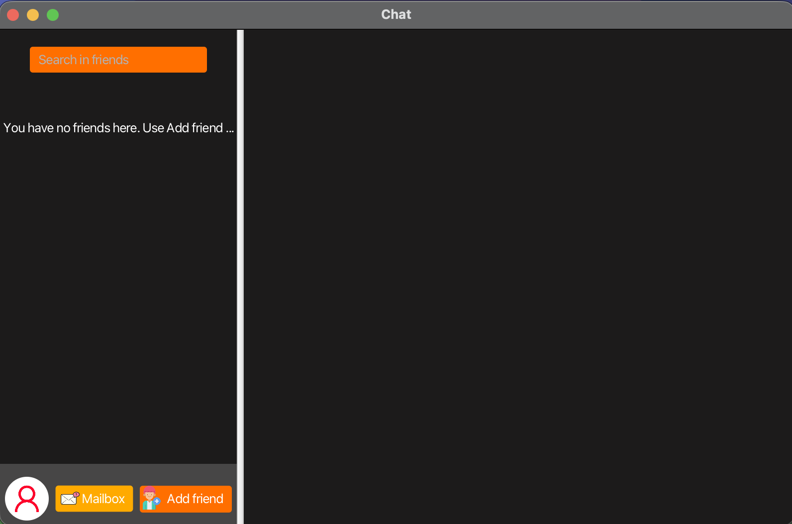
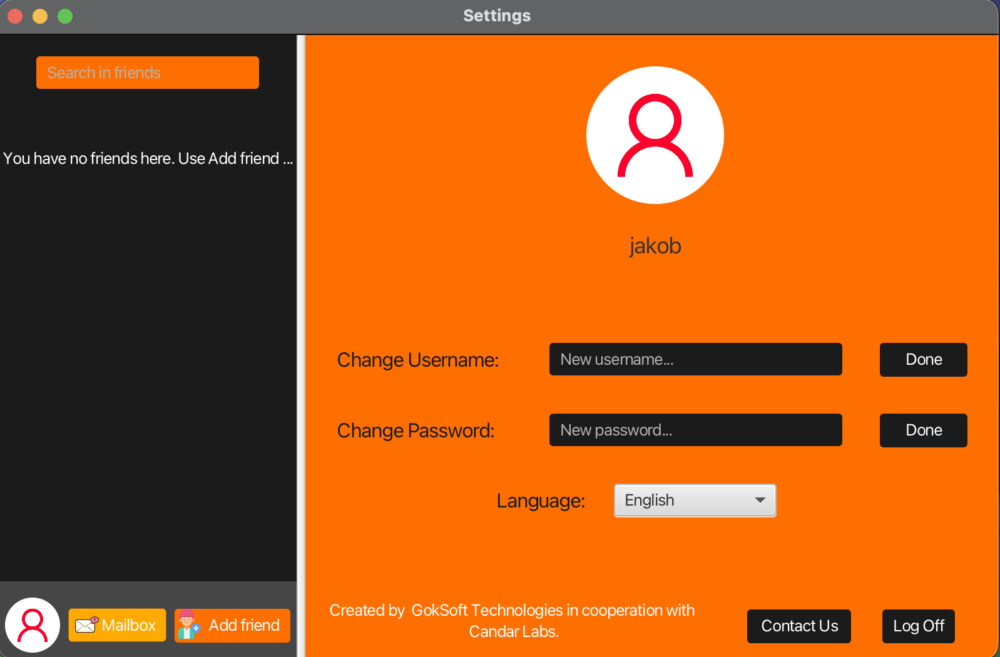

<p align="center">
    
</p>
<p align="center"><h1 align="center">CHAT-APP-FRONTEND</h1></p>
<p align="center">
	
	
	
	
</p>
<br>

## Chat App Frontend

# ⚠️ ARCHIVED - Legacy Frontend

> **This repository is archived and maintained for historical reference only.**
> 
> **🚀 For the active, modernized version, see:** [Java-ChatApp](https://github.com/JakobGokpinar/Java-ChatApp)
> 
> This legacy frontend connects to the old PHP backend. The new version includes:
> - Modern Spring Boot REST API integration
> - Improved code structure
> - Better dependency management
> - Active development and improvements
> 
> ---
> 

<br>
This is the JavaFX desktop client for the Chat App messaging application. It connects to the PHP backend for authentication, messaging, and friend management.

## Quick Setup

### Prerequisites
- Java 17+
- JavaFX SDK 21
- IntelliJ IDEA (recommended)

### Installation

1. **Clone Repository**
   ```bash
   git clone https://github.com/JakobGokpinar/Chat-App-Frontend.git
   cd Chat-App-Frontend
   ```

2. **Download Dependencies**
   
   **JavaFX SDK 21:**
   - Download from [openjfx.io](https://openjfx.io/)
   - Extract to `~/javafx-21/` (or your preferred location)
   
   **JSON Simple:**
   ```bash
   mkdir libs
   cd libs
   curl -O https://repo1.maven.org/maven2/com/googlecode/json-simple/json-simple/1.1.1/json-simple-1.1.1.jar
   ```

3. **Open in IntelliJ**
   - **File → Open** → Select `Chat-App-Frontend` folder
   - Wait for project to load

4. **Configure Libraries**
   - **File → Project Structure → Libraries**
   - Add JavaFX: **+** → Java → Select `~/javafx-21/lib`
   - Add JSON: **+** → Java → Select `libs/json-simple-1.1.1.jar`

5. **Create Run Configuration**
   - **Run → Edit Configurations → +** → Application
   - **Main class:** `goksoft.chat.app.Main`
   - **VM options:**
     ```
     --module-path /Users/YOUR_USERNAME/javafx-21/lib --add-modules javafx.controls,javafx.fxml
     ```
   - Update path to match your JavaFX location

6. **Update Backend URL**
   
   Edit `src/goksoft/chat/app/ServerFunctions.java`:
   ```java
   static final String serverURL = "http://localhost:8888/Chat-App-Backend/";
   // For XAMPP use: "http://localhost/Chat-App-Backend/"
   ```

### Backend Setup

This frontend requires the PHP backend from:
👉 **[Chat-App-Backend](https://github.com/JakobGokpinar/Chat-App-Backend)**

Ensure the backend is running before starting the frontend.

## Usage

1. **Start Backend** (MAMP/XAMPP servers must be running)
2. **Run Frontend** (Click green ▶️ in IntelliJ)
3. **Register** a new user or **Login** with existing credentials
4. **Add Friends** by searching usernames
5. **Send Messages** to your friends

### Features

- User registration and authentication
- Friend request system (send, accept, reject)
- Real-time messaging
- Profile photo management
- User search
- Notification system for unread messages

### Default Login (Development)

The code pre-fills login credentials for testing:
- Username: `jakob`
- Password: `1234`

You can modify this in `LoginController.java` → `initialize()` method.

## Tech Stack

- **JavaFX 21** - Desktop UI framework
- **Java 17** - Programming language
- **JSON Simple** - JSON parsing
- **HTTP Requests** - Communication with PHP backend

## Common Issues

**"Cannot resolve symbol 'javafx'"**
- Re-add JavaFX library in Project Structure

**"JavaFX runtime components are missing"**
- Add VM options to Run Configuration

**"Connection refused" on login/register**
- Check if MAMP/XAMPP is running
- Verify backend URL in `ServerFunctions.java`

---

### Original README (JavaFX Frontend - 2020)
This is a messaging application built with Java and JavaFX. Users can register themselves and add their friends on the platform, exactly like any other messaging app like WhatsApp and Messenger. This repository contains the frontend code of the application, aimed for desktop usage purposes.

## Screenshots

### Login Screen


### Main Chat Interface


### Settings


## Table of Contents
- [Features](#features)
- [Technologies Used](#technologies-used)
- [Project Setup and Installation](#project-setup-and-installation)
- [Usage](#usage)
- [Contributing](#contributing)
- [License](#license)
- [Contact Information](#contact-information)

## Features
- User Registration and Login
- Adding Friends
- Changing Profile Picture
- Messaging
- Register Controllers

## Technologies Used
- Java
- JavaFX

## Project Structure
```sh
└── Chat-App-Frontend/
    ├── README.md
    ├── chatapp.iml
    ├── out
    │   ├── artifacts
    │   │   ├── chatapp_jar
    │   │   │   └── chatapp.jar
    │   │   └── chatapplication
    │   │       └── chatapplication.jar
    │   └── production
    │       └── chatapp
    │           ├── META-INF
    │           │   └── MANIFEST.MF
    │           └── goksoft
    │               └── chat
    └── src
        ├── META-INF
        │   └── MANIFEST.MF
        └── goksoft
            └── chat
                └── app
                    ├── ContactPanelController.java
                    ├── ControllerRules.java
                    ├── ErrorClass
                    ├── Function.java
                    ├── GUIComponents.java
                    ├── GlobalVariables.java
                    ├── Launcher.java
                    ├── LoginController.java
                    ├── Main.java
                    ├── MainPanelController.java
                    ├── RegisterController.java
                    ├── ServerFunctions.java
                    ├── WarningWindowController.java
                    ├── images
                    ├── stylesheets
                    └── userinterfaces
```

## Project Setup and Installation

### Prerequisites
- Java Development Kit (JDK) 8 or higher
- JavaFX SDK
- An IDE such as IntelliJ IDEA or Eclipse

### Installation Steps
1. Clone the repository:
    ```bash
    git clone https://github.com/yourusername/chat-app-frontend.git
    ```
2. Open the project in your IDE.
3. Set up JavaFX SDK in your IDE.
4. Build and run the project.

## Usage
1. Launch the application.
2. Register a new user or log in with existing credentials.
3. Add friends using their username.
4. Start messaging your friends.
5. Change your profile picture from the settings menu.

## Contributing
Contributions are welcome! Please follow these steps to contribute:
1. Fork the repository.
2. Create a new branch: `git checkout -b feature/your-feature-name`.
3. Make your changes and commit them: `git commit -m 'Add some feature'`.
4. Push to the branch: `git push origin feature/your-feature-name`.
5. Open a pull request.

## License
This project is licensed under the MIT License. See the [LICENSE](LICENSE) file for details.

## Contact Information
For any questions or support, please send an email to my address.
